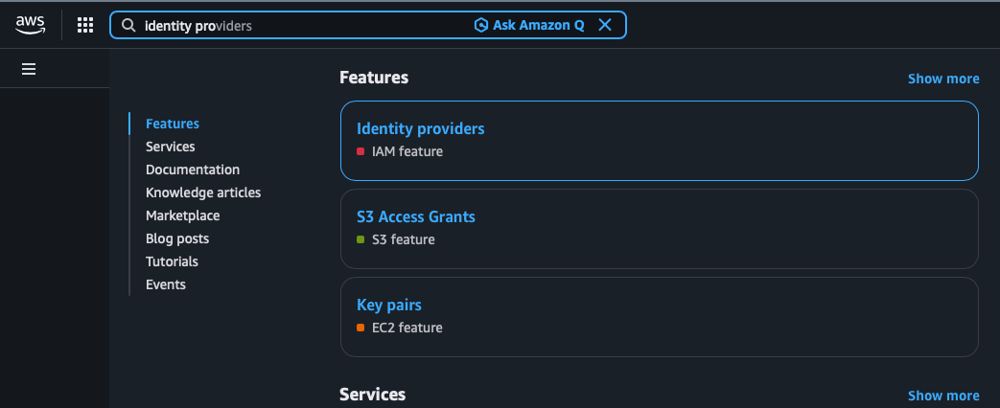
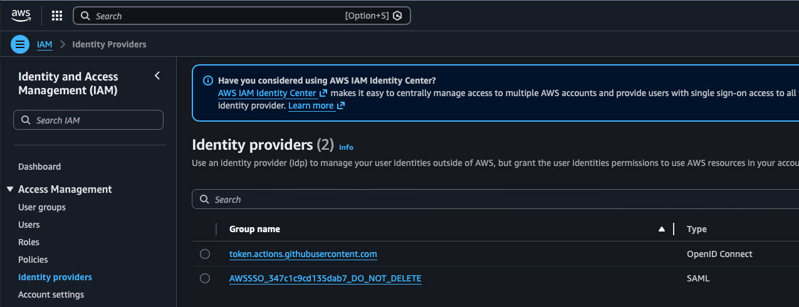
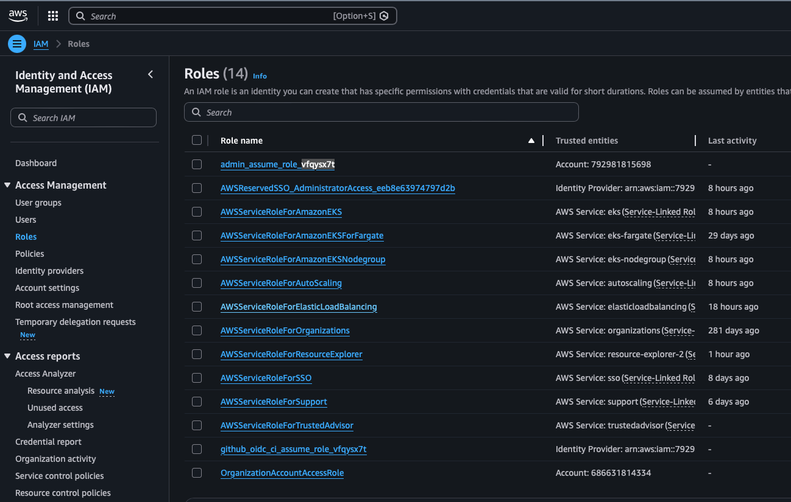

= 001 - Once Per Account

All projects located in this folder are considered *Global* in Aws and are expected to be executed once per account. Each project is labeled with a number indicating the step order in which it should be executed.

[WARNING]
Not once per environment, ONCE PER ACCOUNT!!!

== 001-setup-oidc-provider

This project is executed once per account and once it has been enabled oidc is available for the configured provider.

=== Execution

* `terraform init`
* `terraform fmt`
* `terraform validate`
* `terraform apply --auto-approve`

=== Verification

You can verify it has been enabled by in Aws Console searching `Identity provider`

Click on `Identity providers` which should take you to the following ...

Where you should see `token.actions.githubusercontent.com`

== 002-setup-iam-roles

This project is executed once per account and provides the actual oidc role that is used for execution.

In addition, this project will also create a true admin IAM role that can be configured to be assumed by other roles. This is done as a helper role and may not be necessary (or a good idea) in a true production environment, but it is done as configured SSO roles are not true IAM roles and have some limitations. Creating this admin role allows users to assume a true IAM role locally and operate within pure IAM without the SSO restrictions.

Lastly, this project will configure several GitHub secrets. As this feels a bit out of flow the GitHub secret creation may be more appropriate as its own Terraform/OpenTofu project but for the time being I am leaving it here as the secret creation needs access to the newly created role arns.

=== Execution

* `terraform init`
* `terraform fmt`
* `terraform validate`
* `terraform apply --auto-approve -var-file=gh-token.tfvars`

[NOTE]
The var-file is only supplied here in order to provide the GH token. All resources created by this project are considered *GLOBAL* and are available across region.

=== Verification

