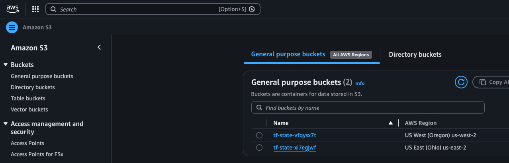

= 002 - Once Per Region

All projects located in this folder are considered *Regional* in Aws and are expected to be executed once per region. Each project is labeled with a number indicating the step order in which it should be executed.

[WARNING]
Not once per account, ONCE PER REGION!!!

[WARNING]
S3 bucket names are truly global, meaning they are global among all Aws users, not just your account. For this reason a different unique value will need to be applied to the bucket name when creating buckets in different accounts

== 001-setup-s3-bucket

This project must be executed in each region that you want to deploy other infrastructure into. This is to provide the S3 bucket to contain the Terraform/OpenTofu state. In example, if you want to deploy infrastructure to `us-east-2` then you need a bucket in `us-east-2` to hold that state.

=== Execution

* `terraform init`
* `terraform fmt`
* `terraform validate`
* `terraform apply --auto-approve -var-file=us-east-2.tfvars`
** To deploy to an alternate region supply a different tfvars file
** IMPORTANT!!! Make sure postfix is updated with the generated value from `002-setup-iam-roles`

=== Verification

Search for S3 in Aws Console and navigate to the S3 page.

